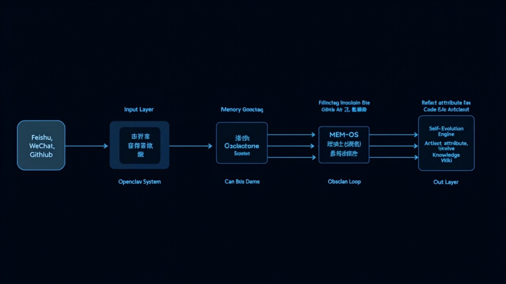
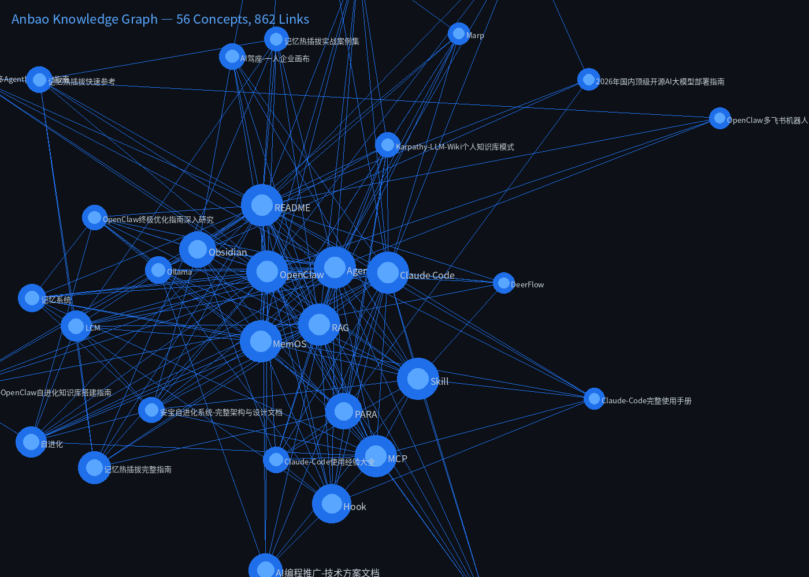
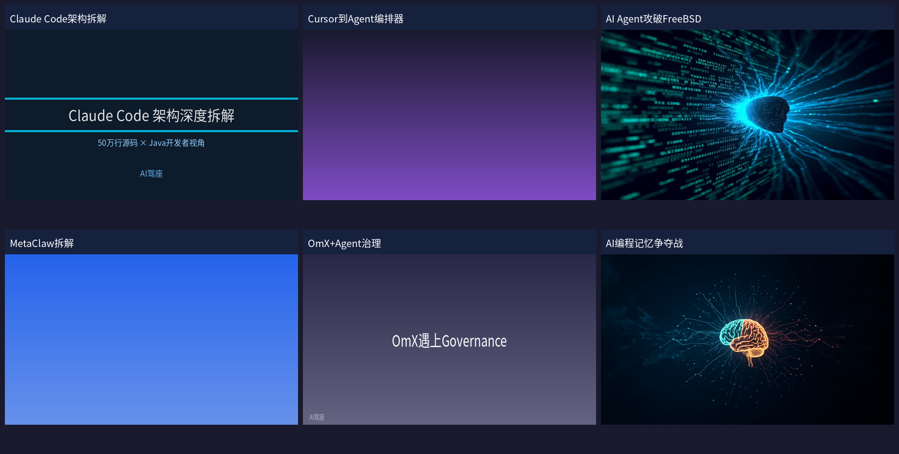

# 🤖 Anbao — 有记忆、能进化的 AI Agent 系统

> 不是聊天机器人。是一个每天都在变聪明的 AI 伙伴。

## ✨ 效果展示

### 系统架构



### 知识图谱自动生长

从零开始，Agent 自动维护的概念知识网络：



| 指标 | 数据 |
|------|------|
| 概念页 | 56 个 |
| Obsidian 笔记 | 85+ 篇 |
| 双链关系 | 862 条 |
| 孤岛概念 | **0**（全部互联） |

### 全自动内容生产

选题 → 素材采集 → 写作 → 封面生成 → 发布，全程无人干预：



**已发布 6 篇文章到「AI驾座」公众号：**
1. 《拆解50万行代码：Claude Code的架构为什么让Java开发者焦虑？》
2. 《用Spring Boot思维拆解MetaClaw》
3. 《从Cursor到Agent编排器：Java开发者的AI编程进化路线图》
4. 《AI Agent自主攻破FreeBSD：CVE-2026-4747深度分析》
5. 《AI编程Agent治理：从OmX到Microsoft的方案对比》
6. 《23万星标争夺战：AI编程Agent的"记忆"到底该怎么管？》

## 🎯 这是什么

一个**可复现的 AI Agent 定制部署方案**，核心能力：

| 能力 | 实现 | 效果 |
|------|------|------|
| **记忆系统** | MemOS 向量数据库 + Obsidian 知识库 | 对话有上下文，越用越懂你 |
| **自进化循环** | 反思 → 归因 → 规则更新 → 下次改进 | 44 次任务，100% 成功率 |
| **全自动内容生产** | 选题 → 采集 → 写作 → 封面 → 发布 | 6 篇文章，每日定时执行 |
| **知识图谱** | 概念页 + 双链 + Lint 健康检查 | 862 条关系，0 个孤岛 |
| **多 Agent 协作** | 安宝（主编排）+ CodeBot（代码开发） | Spring AI RAG 项目 2 分钟交付 |

## 🏗️ 项目结构

```
├── spring-ai-rag-demo/    # Spring Boot 3.3 + Spring AI RAG 示例
│   ├── pom.xml
│   └── src/               # 3个Java类，最小可运行RAG
├── scripts/               # Agent 自进化脚本
│   ├── reflect.sh         # 任务反思与归因分析
│   ├── article-flow.py    # 文章生产流水线状态管理
│   └── wiki-ingest.py     # Obsidian 笔记双链自动补全
├── data/
│   └── graph-data.json    # 知识图谱数据（56节点/862边）
└── docs/images/           # 效果截图
```

## 🚀 快速开始

### Spring AI RAG Demo

```bash
cd spring-ai-rag-demo
# 配置 application.yml 中的 API key
mvn spring-boot:run
curl http://localhost:8080/rag?q=什么是RAG
```

### 知识图谱可视化

```bash
pip install Pillow
python scripts/knowledge-graph.py
# 输出：data/knowledge-graph/graph.mmd + stats.json
```

## 📊 系统全景

| 维度 | 数据 |
|------|------|
| Agent Skills | 62 个 |
| 概念知识页 | 56 个 |
| Obsidian 笔记 | 85+ 篇 |
| 反思记录 | 44 条（100% 成功） |
| 已发布文章 | 6 篇 |
| 自动化 Cron | 10 个 |
| 进化脚本 | 26 个 / 5600 行 |

## 🛠️ 技术栈

| 层 | 技术 |
|---|------|
| Agent 框架 | [OpenClaw](https://openclaw.ai) 2026.4.2 |
| 模型 | GLM-5.1（主力）+ MiniMax-M2.7（fallback） |
| 记忆 | MemOS Local（向量 + BM25 混合检索） |
| 知识库 | Obsidian + PARA 方法 + 双链 |
| 发布 | 微信公众号（baoyu-post-to-wechat） |
| 后端 | Java 11 / Spring Boot / Spring AI |

## 💬 需要定制？

如果你也想搭建这样的系统：

- 📧 xiepp0210@gmail.com
- 📱 微信号可通过公众号「**AI驾座**」获取

**交付能力：**

| 套餐 | 内容 | 交付时间 |
|------|------|----------|
| 基础版 | 飞书/企微Bot + 记忆 + 3个Skills | 2-3 天 |
| 标准版 | 多平台 + 完整记忆 + 10个Skills + 人格定制 | 1 周 |
| 高级版 | 多Agent协作 + 知识库 + Wiki + Cron + 维护 | 2-3 周 |

## 📄 License

MIT
